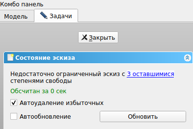
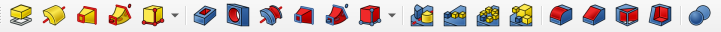
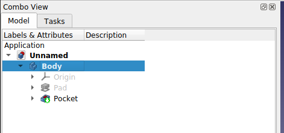

## Введение

Работа с чертежами -- необходимый навык для любого мейкера. Полный
инженерный курс черчения включает в себя как минимум начертательную
геометрию и инженерную графику + основы дизайна в качестве опции. Это
отличная база, которая тем не менее требует серьезных затрат сил и
времени. На мой взгляд, сконцентрировав внимание на наиболее важных
задачах, можно значительно упростить себе жизнь.

Какие цели я считаю наиболее важными?

1)  Умение читать чертежи
2)  Навык построения технического рисунка
3)  Владение САПР (она же CAD)

Ознакомиться с принципами чтения чертежей и выполнения технического
рисунка можно с помощью следующих материалов:

-   Чтение чертежей
    [*https://www.youtube.com/watch?v=UaVqq4lhbzE*](https://www.youtube.com/watch?v=UaVqq4lhbzE)
-   Эскиз и технический рисунок
    [*https://www.youtube.com/watch?v=Hy0caf0pBfo*](https://www.youtube.com/watch?v=Hy0caf0pBfo)

Основная же часть данного туториала будет посвящена быстрому погружению
в работу с приложением для моделирования FreeCad.

## 0. САПР FreeCad

САПР (система автоматизированного проектирования) позволяет перебросить
мост между человеческим желанием и компьютерными возможностями. Так
объект, получивший цифровое представление, может быть изготовлен с
помощью настоящих роботов -- станков с программным управлением.

Существует немало различных САПР, как профессионального, так и
любительского уровня. В данном цикле материалов мы будем обсуждать
систему FreeCad. Она бесплатна, имеет открытый исходный код и развитый
функционал. Но чтобы научиться ей пользоваться, придется переосмыслить
принципы построения чертежей.

В процессе обучения, будем опираться на официальную документацию

[*https://wiki.freecad.org/*](https://wiki.freecad.org/Getting_started/ru)

и ютуб-канал Виктора Игнатова, который разбирает много интересных
возможностей программы

[*https://www.youtube.com/channel/UC5nqtWv3094XLubtxzvK8zg*](https://www.youtube.com/channel/UC5nqtWv3094XLubtxzvK8zg)

## 1. Интерфейс

Инструменты моделирования FreeCad сгруппированы по верстакам
(workbenches). Нужный верстак можно найти в разделе меню View \>
Workbench. Несмотря на большое количество разнообразных верстаков, в
первую очередь мы будем пользоваться только Part Design и Sketcher.

Более подробно особенности интерфейса описаны в статье:

[*https://wiki.freecad.org/Getting\_started/ru*](https://wiki.freecad.org/Getting_started/ru)

## 2. Простейший объект

Попробуем сразу же создать простой 3д-объект. Это будет кубик со
стороной 2 см. Процесс моделирования с помощью верстака Part Design
состоит в осном из последовательного повторения двух этапов:

1)  строим эскиз очередной части модели,
2)  применяем к эскизу операцию твердотельного моделирования
    (выдавливание, вдавливание и пр.)

И так, пока объект не примет нужную форму \^\_\^ Для куба потребуется
один эскиз и одна операция выдавливания. Для удобства восприятия полный
процесс создания кубика записан на видео.

[*https://www.youtube.com/watch?v=pKL\_8Q4UvVE&list=PL59YBNGcXNKpjP4QpxKU31I17N05RraTa&index=1*](https://www.youtube.com/watch?v=pKL_8Q4UvVE&list=PL59YBNGcXNKpjP4QpxKU31I17N05RraTa&index=1)\

Задание на закрепление материала

Попробуй создать цилиндр с помощью инструментов Part Design.

## 3. Параметризация эскиза

В этом разделе разберем один тонкий момент, который повышает комфорт от
моделирования в среде FreeCad. А именно, обсудим идею построения
чертежей с помощью ограничений.

В процессе построения чертежа на бумаге всегда приходится помнить о
размерах, чтобы объект приобрел нужную форму. Для этого приходится
отмерять размеры с помощью линейки или хотя бы пытаться сохранять
пропорции между деталями. Так или иначе, размеры всегда приходится
держать в голове.

Но в среда FreeCad гораздо удобнее работать задом наперед, таким
образом, что простановка размеров становится одним из последних этапов
работы с эскизом.

А начинается рабочий процесс с зарисовки силуэта будущего объекта. Нужно
просто построить замкнутый контур, отдаленно напоминающий модель, не
задумываясь глубоко о положение вершин и линий. Когда контур построен, в
дело вступают инструменты параметризации, с помощью которых мы задаем
все необходимые размеры и взаимное расположение элементов эскиза. В
процессе расстановки размеров FreeCad самостоятельно придает чертежу
правильную форму.

В предыдущей части мы уже использовали параметризацию для определения
размеров куба. В этом видео разберем, как всё работает в более сложной
ситуации, когда контуров несколько.

[*https://www.youtube.com/watch?v=QWA23cym-JE&list=PL59YBNGcXNKpjP4QpxKU31I17N05RraTa&index=2*](https://www.youtube.com/watch?v=QWA23cym-JE&list=PL59YBNGcXNKpjP4QpxKU31I17N05RraTa&index=2)\

### 3.5 Степени свободы, ограничения и привязки

На предыдущем шаге мы использовали 2 инструмента для параметризации
эскиза: расстояние по вертикали
 и по
горизонтали. 

А вот как выглядит полный набор:

Можно разделить инструменты параметризации на 2 основных класса:
привязки и ограничения.

Ограничения задают числовое значение параметра: расстояние, диаметр (или
радиус), величину угла. Привязки задают отношения между частями эскиза:
параллельность двух линий, принадлежность точки отрезку,
перпендикулярность и пр.

Незафиксированные параметры также называются степенями свободы -- их
можно изменять вручную, перемещая связанные элементы эскиза мышкой вдоль
доступных направлени. Чем меньше степеней свободы, тем "жестче" эскиз и
меньше возможностей его деформировать. Количество степеней свободы
FreeCad считает самостоятельно и отображает в блоке "состояние эскиза".

Полная параметризация эскиза, когда число степеней свободы равно нулю не
всегда необходима, но она позволять понять, что все размеры заданы и на
чертеже нет случайных смещений.

## 4. Операции твердотельного моделирования

Теперь, когда мы разобрались как эскизы превращаются в чертежи, пришла
пора поговорить о твердотельном моделировании более подробно. Сперва
пара слов о том, почему моделирование называется твердотельным. Дело в
том, что FreeCad считает все созданные объекты твердыми телами, которые
не подвергаются деформации при взаимодействии между собой.

Эти твердые тела мы получаем из эскизов с помощью набора операций,
входящего в состав верстака Part Design

В предыдущих примерах мы уже использовали инструмент "Выдавливание".
Остался последний вопрос: если нужную модель нельзя построить с помощью
одного эскиза и одной операции, что нужно делать? Ответ такой: нужно
разделить объект на достаточно простые элементы и последовательно
добавлять их, пока модель не примет нужную форму. При этом можно
выбирать плоскости для новых эскизы на гранях уже построенных тел или
задавать отдельно.

На видео представлен пример построения сложного тела с помощью
нескольких эскизов.

[*https://www.youtube.com/watch?v=60wp\_FpCAvk&list=PL59YBNGcXNKpjP4QpxKU31I17N05RraTa&index=3*](https://www.youtube.com/watch?v=60wp_FpCAvk&list=PL59YBNGcXNKpjP4QpxKU31I17N05RraTa&index=3)

## 5. Экспорт моделей

В чем заключается самое главное преимущество цифровой модели? Её можно
превратить в реальный объект с помощью магии программного управления!
Например, распечатать на 3д-принтере или выточить на станке с ЧПУ. Но
различные системы программного управления поддерживают разные форматы
данных, конвертация из одного в другой может оказаться непростой
задачей. Пока нам будет достаточно экспорта в STL-формат. STL-файл уже
не содержит набора твердых тел и связей между ними, поэтому его не
слишком удобно редактировать во FreeCad, но с другой стороны STL-модели
можно печатать на 3д-принтере после проведения процедуры слайсинга
(более подробно о 3д-печати поговорим в другом руководстве).

Чтобы экспортировать модель, нужно выбрать нужное тело во вкладке Model,

затем в меню выбрать File \> Export. Откроется диалог, где нужно указать
название файла и выбрать формат STL.

## 6. Реверс-инжениринг

В предыдущих уроках мы занимались моделированием трехмерных объектов с
нуля. Но что если уже есть какая-то модель, которую необходимо
отредактировать? Добавить к ней новые элементы?

FreeCad обладает средствами, которые помогут нам справиться с большей
частью подобных трудностей. Общие схемы действий представлены в роликах
ниже:

FreeCad Комбинированное скругление

[*https://www.youtube.com/watch?v=wLU2OeXczic*](https://www.youtube.com/watch?v=wLU2OeXczic)

FreeCad Коррекция STL модели

[*https://www.youtube.com/watch?v=WszStsOdPo4*](https://www.youtube.com/watch?v=WszStsOdPo4)

FreeCad Работаем с STL моделями

[*https://www.youtube.com/watch?v=5DszZ38z-ic*](https://www.youtube.com/watch?v=5DszZ38z-ic)

FreeCad Деталь по образцу STL модели

[*https://www.youtube.com/watch?v=A0bbWuiLgGs&t=4s*](https://www.youtube.com/watch?v=A0bbWuiLgGs&t=4s)

FreeCad STL в твёрдое

[*https://www.youtube.com/watch?v=hqjFjwKVE98*](https://www.youtube.com/watch?v=hqjFjwKVE98)

FreeCad верстак IMAGE

[*https://www.youtube.com/watch?v=92lPSMx4\_Xs*](https://www.youtube.com/watch?v=92lPSMx4_Xs)

FreeCad Объединение STL моделей

[*https://www.youtube.com/watch?v=bCMvnKX-1Is*](https://www.youtube.com/watch?v=bCMvnKX-1Is)
